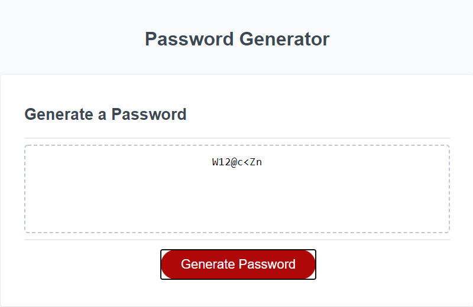

# Password Generator

## Description

I created an application that can generated a randomized password based on certain criterias. The app itself will run on the web browser itself. We were given a starter code and our job was to fill in the missing code. 

## Table of Contents

* [Features](#Features)
* [Links](#Links)
* [Screenshots](#Screenshots)
* [Code-Example](#Code-Example)
* [Reference](#Reference)
* [Tests/Issues](#Tests/Issues)
* [Contribute/Credits](#Contribute/Credits)
* [License](#License)

## Features

* The application can:
    * Let the user choose a number between 8 to 128 for their password,
    * Let the user choose if they want to include lowercase letters, uppercase letters, numbers, or special characters,
    * Then generated a password base on their needs.

## Links

* [Project Repo: Password Generator](https://github.com/jeishu/password-generator)
* [GitHub Page: Password Generator](https://jeishu.github.io/password-generator/)

## Screenshots

How the prompt looks like when the Generate Button is clicked:


How the confirm pop up looks like:


How the pop looks when you did not enter a number that is between 8 and 128:


How the password looks when it is generated:


## Code-Example

I created an array for each of the categories and corresponding confirms. 
I created variables as need.
Arrays are separated by "".
```
var lowerCase = ["a", "b", "c", "d", "e", "f", "g", "h", "i", "j", "k", "l", "m", "n", "o", "p", "q", "r", "s", "t", "u", "v", "w", "x", "y", "z"];

var filterLower = confirm("Do you want to have lowercase letters in your password?");
                
```

## Reference

These are websites I used to aid me in learning different syntax and different methods, functions, etc for Javascript.

> - [Developer Mozilla](https://developer.mozilla.org/en-US/) || I had a lot of difficulty learning different methods and this website helps
> - [W3School](https://www.w3schools.com/) || Learn many tricks (prompt(), confirm(), for loops, if statement, return, etc)
> - [Traversy Media](https://www.youtube.com/channel/UC29ju8bIPH5as8OGnQzwJyA) || For most of my JavaScript needs.

These websites aid me in creating this README.md

> - [GitHub Docs](https://docs.github.com/en/free-pro-team@latest/github/writing-on-github/basic-writing-and-formatting-syntax) || Learn most of my README syntax here.
> - [Akash Nimare](https://medium.com/@meakaakka/a-beginners-guide-to-writing-a-kickass-readme-7ac01da88ab3) || Based my README from his person.

## Tests/Issues

> I had a lot of issues with the funtions keep executing.
- I use the 'return;' to stop the execution within lines 31, 35 and 50.
- This help the code to move on.
> Changing the user input from a string to an integer 
- I forgot to convert the string to integer and cause the JS to not function properly.
> Order of Operations
- I had to move some lines of code around in order for the JS to perform properly.
```
  var passwordText = document.querySelector("#password");

  passwordText.value = password;
```
- this line of code was moved from the function writePassword() to the function generatePassword() to make the code work.
> Cleaning up code
- I originally created a new variable for the 'var userInput' that could convert the string to an integer, but I just combined the code and stuck with the original variable
- Both works, but one less line.
```
  // New Code
  // prompt for the user to input a number || convert the string from the user input into an integer
  var userInput = parseInt(prompt("Please choose a number between 8 and 128.")); 

  // Old code
  var userInput = prompt("Please choose a number between 8 and 128.");
  var numInput = parseInt(userInput); 

```
- My confirm methods were originally outside of the else statement on line 37. I moved them inside for a better order of operations.


## Contribute/Credits

- My class instructor, Calvin
- My tutor, Sangeetha
- My study group

## License

MIT © [Jeremy Zhu :: jeishu](https://github.com/jeishu)

